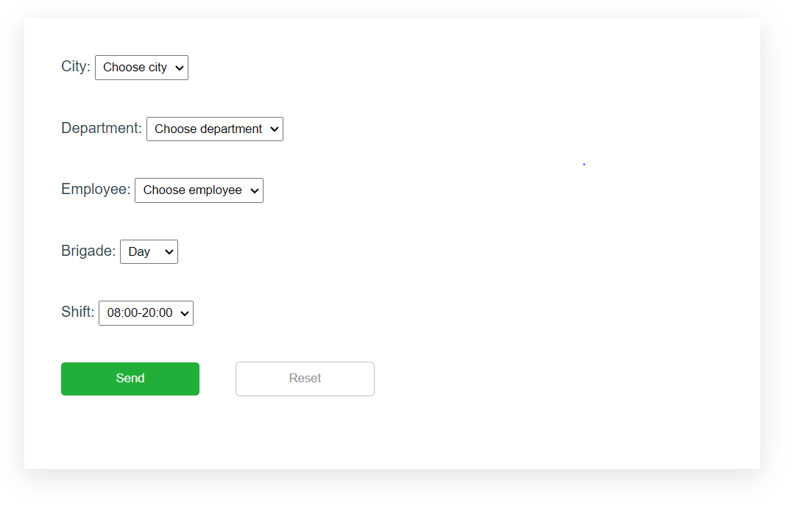

# vue-select

## Связанные выпадающие списки Vue.js

Первые три списка и последние два зависят друг от друга: при выборе города, количество цехов и сотрудников меняется, при выборе цеха или сотрудника аналогично.


## Project setup
```
npm install
```

### Compiles and hot-reloads for development
```
npm run serve
```

### Compiles and minifies for production
```
npm run build
```

### Lints and fixes files
```
npm run lint
```


